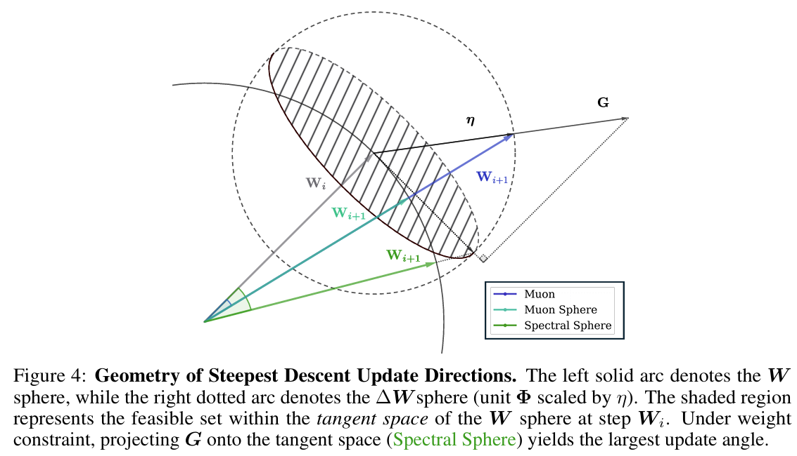
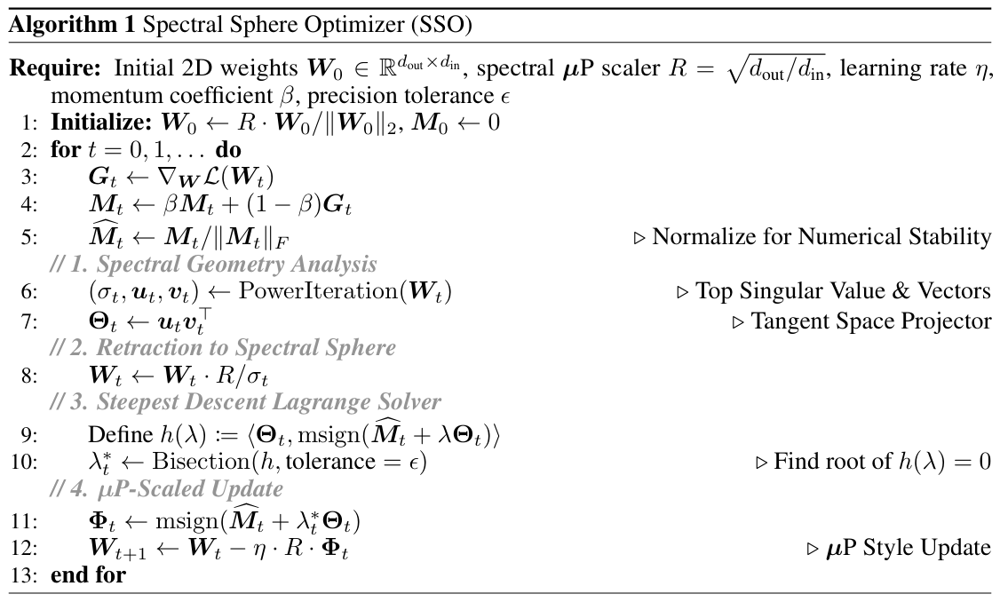
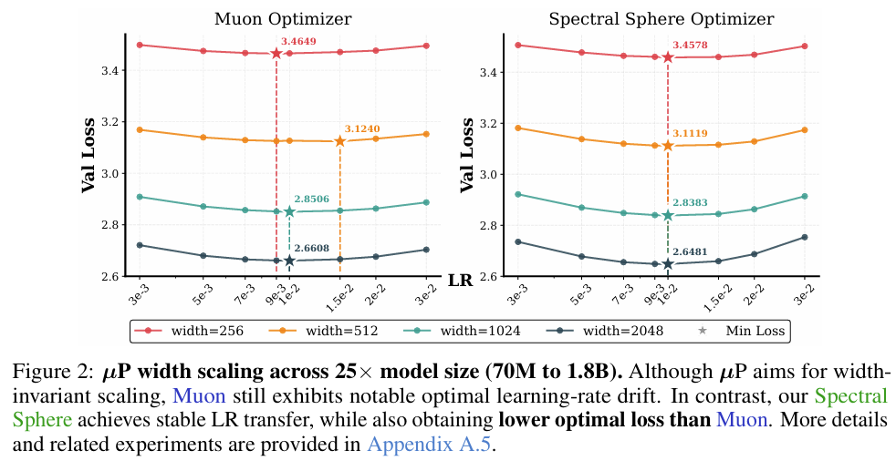
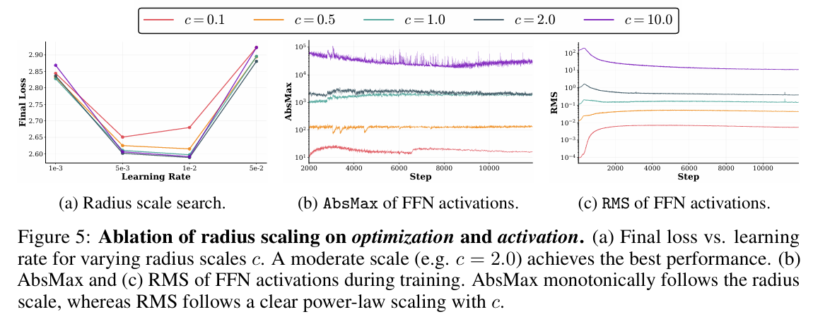
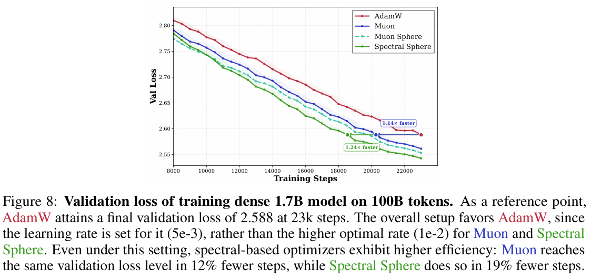
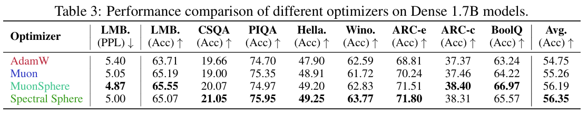
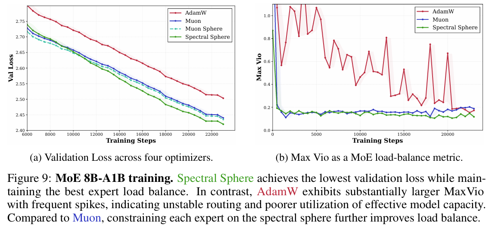

# Controlled LLM Training on Spectral Sphere

<div align="center">
  <a href="sso_paper.pdf">📄 <b>Paper</b></a>  |  
  <a href="https://github.com/Unakar/Megatron-LM/tree/spectral_ball"> <b>Megatron-LM</b></a>  |  
  <a href="https://wandb.ai/rqn17762075640-ustc/optimizer_baselines_arena"> <b>WandB</b></a>  |  
</div>

## 1. Introduction

This repository contains the official implementation for the paper: **[Controlled LLM Training on Spectral Sphere](sso_paper.pdf)**.

> **Abstract:** Scaling large models requires optimization strategies that ensure rapid convergence grounded in stability. Maximal Update Parametrization (μP) provides a theoretical safeguard for width-invariant Θ(1) activation control, whereas emerging optimizers like Muon are only "half-aligned" with these constraints: they control updates but allow weights to drift. To address this limitation, we introduce the **Spectral Sphere Optimizer (SSO)**, which enforces strict module-wise spectral constraints on both weights and their updates. By deriving the steepest descent direction on the spectral sphere, SSO realizes a fully μP-aligned optimization process. To enable large-scale training, we implement SSO as an efficient parallel algorithm within Megatron. Through extensive pretraining on diverse architectures, including Dense 1.7B, MoE 8B-A1B, and 200-layer DeepNet models, SSO consistently outperforms AdamW and Muon. Furthermore, we observe significant practical stability benefits, including improved MoE router load balancing, suppressed outliers, and strictly bounded activations. Megatron Code is available at [SSO Pretrain](https://github.com/Unakar/Megatron-LM/tree/spectral_ball).

**Key Contributions:**
- **Better Convergence**: Outperforms Adamw and Muon
- **Fully μP Aligned**: Both weights and updates satisfy spectral norm constraints
- **No Weight Decay for 2D Weights**: Eliminates the need for weight decay on hidden layers
- **Improved MoE Load Balancing**: Fast to reach low MoE max-violation metric
- **Bounded Activations**: Strictly controllable activation scale
- **Suppressed Outliers**: Enhanced stability for deep networks 

## 2. [Algorithm](https://github.com/Unakar/Megatron-LM/blob/spectral_ball/emerging_optimizers/orthogonalized_optimizers/spectral_ball_utils.py)

SSO performs **steepest descent** under the **spectral norm**, constraining both the **weights** and the **updates** to a spectral sphere of radius R = Θ(√(d_out/d_in)).

<p align="center">
  
</p>
<p align="center">
  
</p>

## 3. WandB Runs


| Description | Link |
|-------------|------|
| Main Experiments on Dense, MoE, DeepNet | [Baselines](https://wandb.ai/rqn17762075640-ustc/optimizer_baselines_arena) |
| **μ**P Learning Rate Transfer Grid Search | [MuP Search](https://wandb.ai/rqn17762075640-ustc/optimizer_mup_arena) |
| Spectral Radius Search for Tunable Activation Scale | [Radius Search](https://wandb.ai/rqn17762075640-ustc/optimizer_radius_arena) |


## 4. Usage

### Megatron-LM Integration

SSO is implemented in our fork of Megatron-LM. Use `--optimizer spectral_ball_dist` for distributed training.

### Hyperparameters

| Argument | Default | Description |
|----------|---------|-------------|
| `--spectral-ball-momentum` | 0.9 | Momentum coefficient |
| `--spectral-ball-use-nesterov` | True | Use Nesterov-style momentum |
| `--spectral-ball-msign-steps` | 8 | Newton-Schulz iterations for matrix sign |
| `--spectral-ball-solver` | bisection | Lagrange multiplier solver method |
| `--spectral-ball-solver-tolerance-f` | 1e-8 | Solver tolerance |
| `--spectral-ball-solver-max-iterations` | 20 | Maximum solver iterations |
| `--spectral-ball-power-iteration-steps` | 20 | Power iteration steps for top singular vectors |
| `--spectral-ball-radius-mode` | spectral_mup | Mode for computing target radius R |
| `--spectral-ball-radius-scaler` | 1.0 | Scale factor for target radius |
| `--spectral-ball-scale-mode` | spectral_mup | LR scale mode (spectral_mup, align_adamw_rms, shape_scaling) |
| `--spectral-ball-retract-mode` | hard | Retraction mode: hard (project to sphere) or dynamic |
| `--spectral-ball-retract-alpha` | 0.05 | Step size for dynamic retraction |

### Module Granularity Options

| Argument | Default | Description |
|----------|---------|-------------|
| `--spectral-mup-init` | - | Enable spectral μP initialization for weights |
| `--spectral-ball-no-split-qkv` | (enabled) | Disable splitting QKV parameters |
| `--spectral-ball-qkv-split-mode` | component | QKV split: component, group, or head |
| `--spectral-ball-no-split-fc1` | (enabled) | Disable splitting gate/up in SwiGLU |
| `--spectral-ball-no-split-moe-experts` | (enabled) | Disable per-expert splitting in MoE |

### Model "intrinsic Health" Monitors

We support logging metrics below for monitoring training stability. Note that MoE max-vio and module spectral norm are logged by default.

```bash
# log optimizer update rms before lr scaler
--log-per-module-update-rms

--log-per-module-grad-rms

--log-hidden-states embeddings input_layernorm attention::linear_qkv \
    attention::linear_q attention::linear_k attention::linear_v \
    attention::core_attention attention::o_proj pre_mlp_layernorm mlp

# Log parameter statistics
--log-params attention::linear_qkv attention::o_proj mlp::linear_fc1 \
    mlp::linear_fc2 input_layernorm pre_mlp_layernorm embedding lm_head
```

### 5. Benchmark Evaluation

We support downstream task evaluation during training:

```bash
--benchmark-eval
--benchmark-tasks "sciq_rc_0shot,piqa_rc_0shot,winogrande_rc_0shot,arc_easy_rc_0shot,boolq_rc_0shot,logiqa_rc_0shot,lambada_ppl_0shot,hellaswag_rc_5shot,arc_challenge_rc_5shot"
```

## 5. Evaluation
### Learning Rate Transfer

<p align="center">
  
</p>

---

### Controllable Activation Scale

<p align="center">
  
</p>

---


### Dense 1.7B Eval

<p align="center">
  
</p>
<p align="center">
  
</p>

---

### MoE 8B-a1B Eval

<p align="center">
  
</p>

---