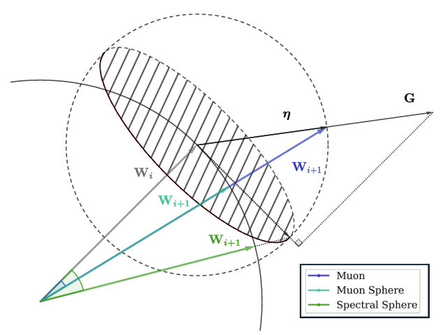
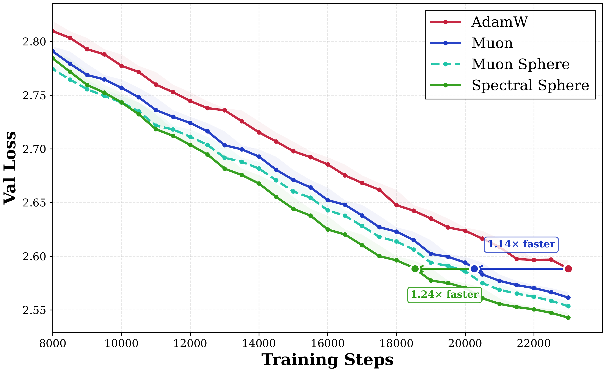

# Fully **μP** Aligned LLM Training on Spectral Sphere

<div align="center">
  <a href="https://github.com/Unakar/Megatron-LM/tree/spectral_ball"> <b>Megatron-LM</b></a>  |  
  <a href="https://wandb.ai/rqn17762075640-ustc/optimizer_baselines_arena"> <b>WandB</b></a>  |  
  <a href="https://huggingface.co/collections/unakar666/spectral-sphere-optimizer"> <b>Models</b></a>
</div>

## Abstract

Maintaining Θ(1) activation scale is a fundamental design principle in deep learning, enabling width-invariant scaling paradigms like **μ**P. While emerging optimizers such as Muon apply spectral constraints to update gradients, they leave weights spectrally unconstrained, which hurts forward stability and breaks scaling law transfer. To address this limitation, we introduce the **Spectral Sphere Optimizer (SSO)**, which enforces strict module-wise spectral constraints on both weights and their updates. By deriving the steepest descent direction on the spectral sphere, SSO realizes a fully **μ**P-aligned optimization process. We implement SSO as an efficient, numerically stable parallel algorithm within Megatron. Through extensive pretraining on diverse architectures, including Dense 1.7B, MoE 8B-A1B, and 200-layer DeepNet models, SSO consistently outperforms AdamW and Muon. Furthermore, we observe significant practical stability benefits, including improved MoE router load balancing, suppressed outliers, and strictly bounded activations. Megatron Code is available at [SSO Pretrain](https://github.com/Unakar/Megatron-LM/tree/spectral_ball).

## Key Features

- **Better Convergence**: Outperforms Adamw and Muon
- **Fully μP Aligned**: Both weights and updates satisfy spectral norm constraints
- **No Weight Decay for 2D Weights**: Eliminates the need for weight decay on hidden layers
- **Improved MoE Load Balancing**: Fast to reach low MoE max-violation metric
- **Bounded Activations**: Strictly controllable activation scale
- **Suppressed Outliers**: Enhanced stability for deep networks 

## Method

SSO performs **steepest descent** under the **spectral norm**, constraining both the **weights** and the **updates** to a spectral sphere of radius R = Θ(√(d_out/d_in)).

<p align="center">
  
</p>

**Geometry of Steepest Descent Update Directions.** The left solid arc denotes the W sphere, while the right dotted arc denotes the ΔW sphere (unit Φ scaled by η). The shaded region represents the feasible set within the tangent space of the W sphere at step W_i. Under weight constraint, projecting G onto the tangent space (Spectral Sphere) yields the largest update angle.

### [Algorithm](https://github.com/Unakar/Megatron-LM/blob/spectral_ball/emerging_optimizers/orthogonalized_optimizers/spectral_ball_utils.py)

```
Algorithm: Spectral Sphere Optimizer (SSO)
─────────────────────────────────────────────────────────────────────────────
Input: Initial 2D weights W₀, spectral μP scaler R = √(d_out/d_in), 
       learning rate η, momentum β, tolerance ε

Initialize: W₀ ← R · W₀ / ‖W₀‖₂,  M₀ ← 0

For t = 0, 1, ...
    G_t ← ∇_W L(W_t)
    M_t ← β·M_t + (1-β)·G_t
    M̂_t ← M_t / ‖M_t‖_F                          # Normalize for stability

    // 1. Spectral Geometry Analysis
    (σ_t, u_t, v_t) ← PowerIteration(W_t)        # Top singular value & vectors
    Θ_t ← u_t · v_t^T                            # Tangent space projector

    // 2. Retraction to Spectral Sphere
    W_t ← W_t · R / σ_t

    // 3. Steepest Descent Lagrange Solver
    Define h(λ) := ⟨Θ_t, msign(M̂_t + λ·Θ_t)⟩
    λ*_t ← Bisection(h, tolerance=ε)             # Find root of h(λ)=0

    // 4. μP-Scaled Update
    Φ_t ← msign(M̂_t + λ*_t · Θ_t)
    W_{t+1} ← W_t - η · R · Φ_t                  # μP style update
```

## WandB Reports


| Description | Link |
|-------------|------|
| Main Experiments on Dense, MoE, DeepNet | [Baselines](https://wandb.ai/rqn17762075640-ustc/optimizer_baselines_arena) |
| **μ**P Learning Rate Transfer Grid Search | [MuP Search](https://wandb.ai/rqn17762075640-ustc/optimizer_mup_arena) |
| Spectral Radius Search for Tunable Activation Scale | [Radius Search](https://wandb.ai/rqn17762075640-ustc/optimizer_radius_arena) |


## Usage

### Megatron-LM Integration

SSO is implemented in our fork of Megatron-LM. Use `--optimizer spectral_ball_dist` for distributed training.

### Hyperparameters

| Argument | Default | Description |
|----------|---------|-------------|
| `--spectral-ball-momentum` | 0.9 | Momentum coefficient |
| `--spectral-ball-use-nesterov` | True | Use Nesterov-style momentum |
| `--spectral-ball-msign-steps` | 8 | Newton-Schulz iterations for matrix sign |
| `--spectral-ball-solver` | bisection | Lagrange multiplier solver method |
| `--spectral-ball-solver-tolerance-f` | 1e-8 | Solver tolerance |
| `--spectral-ball-solver-max-iterations` | 20 | Maximum solver iterations |
| `--spectral-ball-power-iteration-steps` | 20 | Power iteration steps for top singular vectors |
| `--spectral-ball-radius-mode` | spectral_mup | Mode for computing target radius R |
| `--spectral-ball-radius-scaler` | 1.0 | Scale factor for target radius |
| `--spectral-ball-scale-mode` | spectral_mup | LR scale mode (spectral_mup, align_adamw_rms, shape_scaling) |
| `--spectral-ball-retract-mode` | hard | Retraction mode: hard (project to sphere) or dynamic |
| `--spectral-ball-retract-alpha` | 0.05 | Step size for dynamic retraction |

### Module Granularity Options

| Argument | Default | Description |
|----------|---------|-------------|
| `--spectral-mup-init` | - | Enable spectral μP initialization for weights |
| `--spectral-ball-no-split-qkv` | (enabled) | Disable splitting QKV parameters |
| `--spectral-ball-qkv-split-mode` | component | QKV split: component, group, or head |
| `--spectral-ball-no-split-fc1` | (enabled) | Disable splitting gate/up in SwiGLU |
| `--spectral-ball-no-split-moe-experts` | (enabled) | Disable per-expert splitting in MoE |

### Model "intrinsic Health" Monitors

We support logging metrics below for monitoring training stability. Note that MoE max-vio and module spectral norm are logged by default.

```bash
# log optimizer update rms before lr scaler
--log-per-module-update-rms

--log-per-module-grad-rms

--log-hidden-states embeddings input_layernorm attention::linear_qkv \
    attention::linear_q attention::linear_k attention::linear_v \
    attention::core_attention attention::o_proj pre_mlp_layernorm mlp

# Log parameter statistics
--log-params attention::linear_qkv attention::o_proj mlp::linear_fc1 \
    mlp::linear_fc2 input_layernorm pre_mlp_layernorm embedding lm_head
```

### Benchmark Evaluation

We support downstream task evaluation during training:

```bash
--benchmark-eval
--benchmark-tasks "sciq_rc_0shot,piqa_rc_0shot,winogrande_rc_0shot,arc_easy_rc_0shot,boolq_rc_0shot,logiqa_rc_0shot,lambada_ppl_0shot,hellaswag_rc_5shot,arc_challenge_rc_5shot"
```

## Experimental Results

### Dense 1.7B Validation Loss

<p align="center">
  
</p>

As a reference point, AdamW attains a final validation loss of 2.588 at 23k steps. Even under an AdamW-favorable setup (lr tuned for AdamW at 5e-3), spectral-based optimizers exhibit higher efficiency: Muon reaches the same loss in 20.3k steps (12% fewer), while Spectral Sphere does so in 18.5k steps (19% fewer).

### Downstream Task Performance (Dense 1.7B, 100B tokens)

| Optimizer | LMB. PPL↓ | LMB. acc↑ | CSQA↑ | PIQA↑ | Hella.↑ | Wino.↑ | ARC-e↑ | ARC-c↑ | BoolQ↑ | Avg.↑ |
|-----------|-----------|-----------|-------|-------|---------|--------|--------|--------|--------|-------|
| AdamW | 5.40 | 63.71 | 19.66 | 74.70 | 47.90 | 62.59 | 68.81 | 37.37 | 63.24 | 54.75 |
| Muon | 5.05 | 65.19 | 19.00 | 75.35 | 48.91 | 61.72 | 70.24 | 37.46 | 64.22 | 55.26 |
| MuonSphere | **4.87** | **65.55** | 20.07 | 74.97 | 49.20 | 62.83 | 71.51 | **38.40** | **66.97** | 56.19 |
| **Spectral Sphere** | 5.00 | 65.07 | **21.05** | **75.95** | **49.25** | **63.77** | **71.80** | 38.31 | 65.57 | **56.35** |

### Validated Architectures

- **Dense 1.7B**: Qwen3-1.7B architecture with GQA, QK-Norm, SwiGLU, RoPE
- **MoE 8B-A1B**: DeepSeek-V3 style, 27 layers, 64 experts with top-4 routing + 1 shared expert
- **DeepNet 200 Layers**: Stress test for optimizer stability under extreme depth